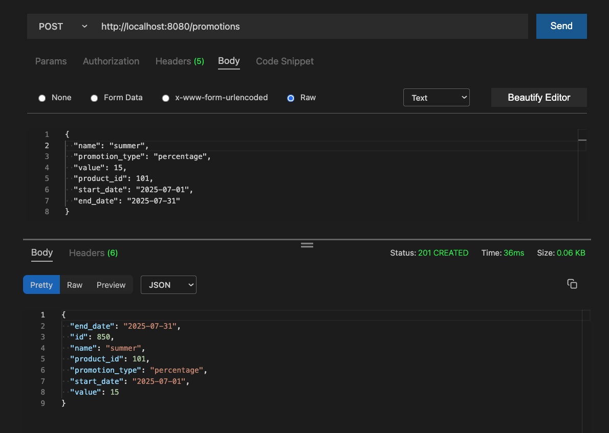
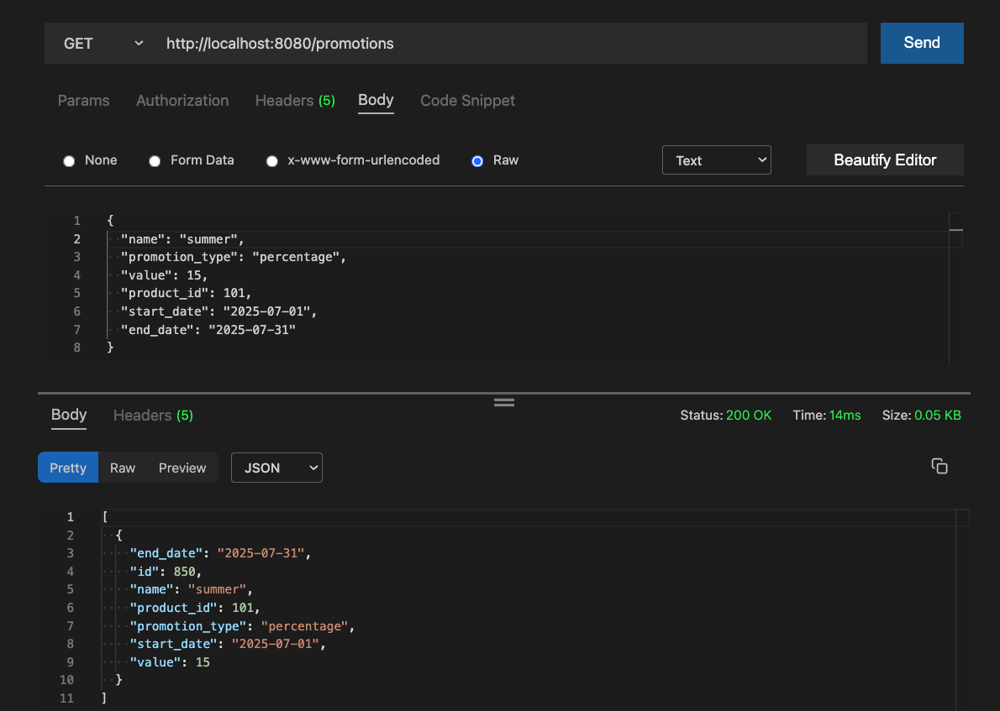
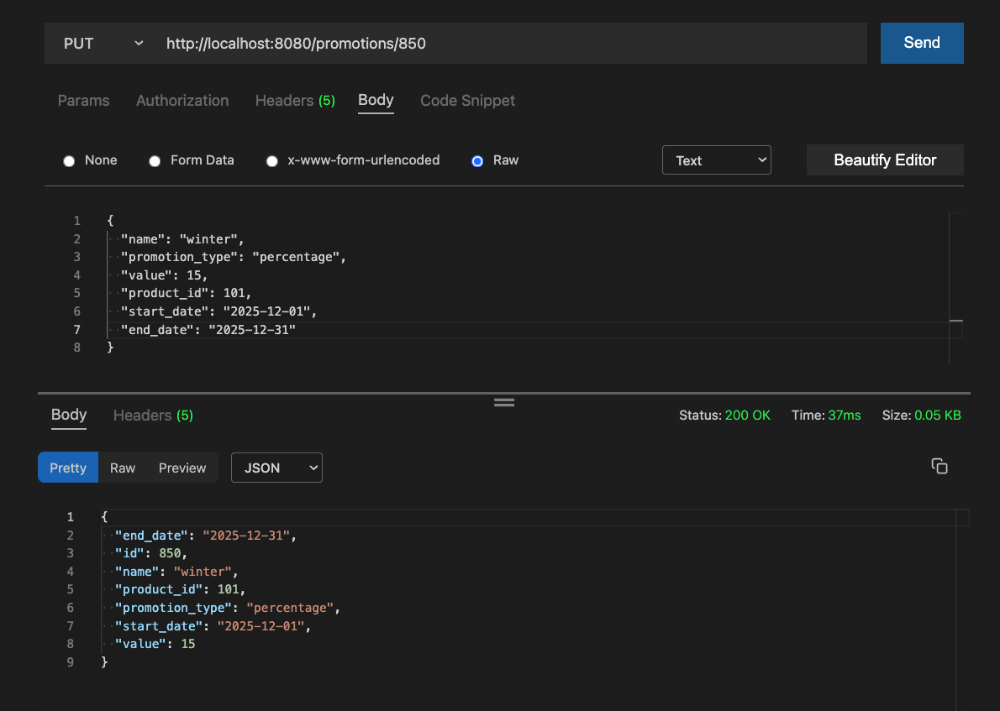
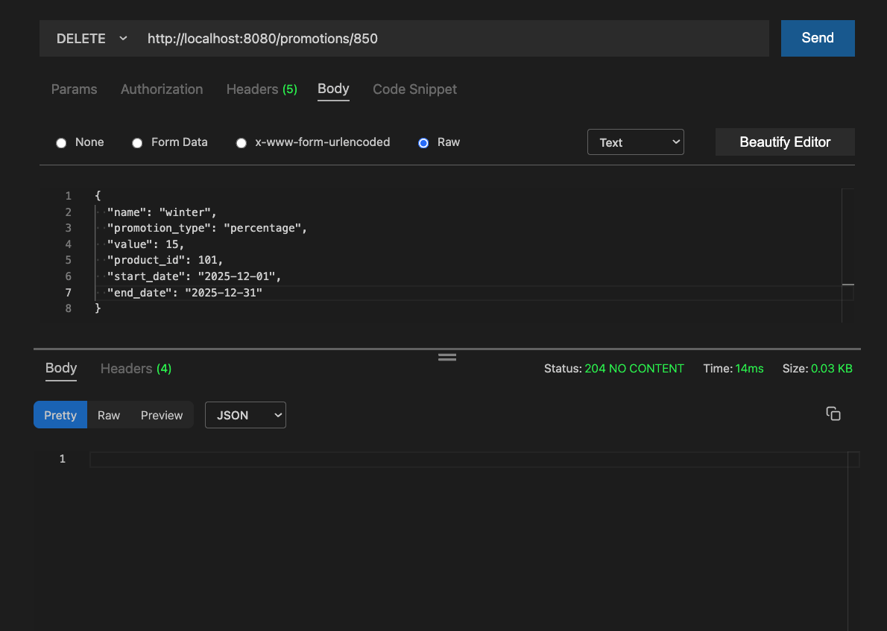

# NYU DevOps - Promotion Team

[](https://opensource.org/licenses/Apache-2.0)
[](https://python.org/)

## API Endpoints

  | Method | Endpoint | Description |
  |--------|----------|-------------|
  | GET | `/` | Service check |
  | GET | `/promotions` | List all promotions |
  | GET | `/promotions?name={name}` | Query promotions by name |
  | GET | `/promotions?product={id}` | Query promotions by product ID |
  | GET | `/promotions?id={id}` | Query promotion by ID |
  | GET | `/promotions/{id}` | Get a specific promotion |
  | POST | `/promotions` | Create a new promotion |
  | PUT | `/promotions/{id}` | Update a promotion |
  | DELETE | `/promotions/{id}` | Delete a promotion |

## Data Model

The Promotion model includes:

- `id`: Unique identifier
- `name`: Promotion name
- `promotion_type`: Type of promotion ("Percentage off", "Buy One Get One")
- `value`: Promotion value (integer)
- `product_id`: Associated product ID
- `start_date`: Promotion start date (YYYY-MM-DD)
- `end_date`: Promotion end date (YYYY-MM-DD)

### Example JSON:

```json
{
  "id": 1,
  "name": "Summer Sale",
  "promotion_type": "Percentage off",
  "value": 25,
  "product_id": 123,
  "start_date": "2024-06-01",
  "end_date": "2024-06-30"
}
```

## Setup and Running

  1. Start the development container
  2. Set up database: `flask db-create`
  3. Run the service: `flask run`
  4. Run tests: `make test`

## Test

Run the full test suite with coverage:
  
```bash
make test
```

Expected coverage: 95%+

## CRUD  Screenshots






## License

Copyright (c) 2016, 2025 [John Rofrano](https://www.linkedin.com/in/JohnRofrano/). All rights reserved.

Licensed under the Apache License. See [LICENSE](LICENSE)

This repository is part of the New York University (NYU) masters class: **CSCI-GA.2820-001 DevOps and Agile Methodologies** created and taught by [John Rofrano](https://cs.nyu.edu/~rofrano/), Adjunct Instructor, NYU Courant Institute, Graduate Division, Computer Science, and NYU Stern School of Business.
